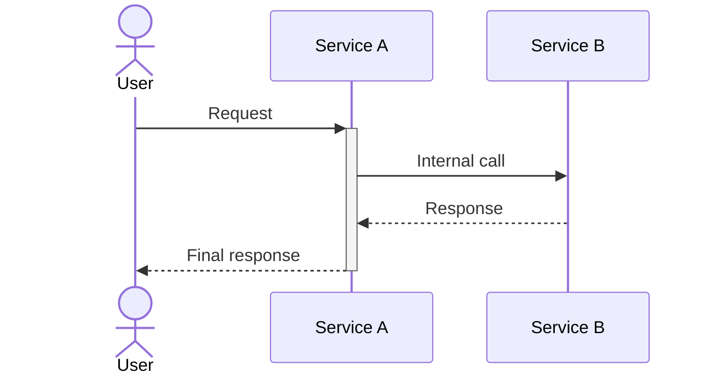
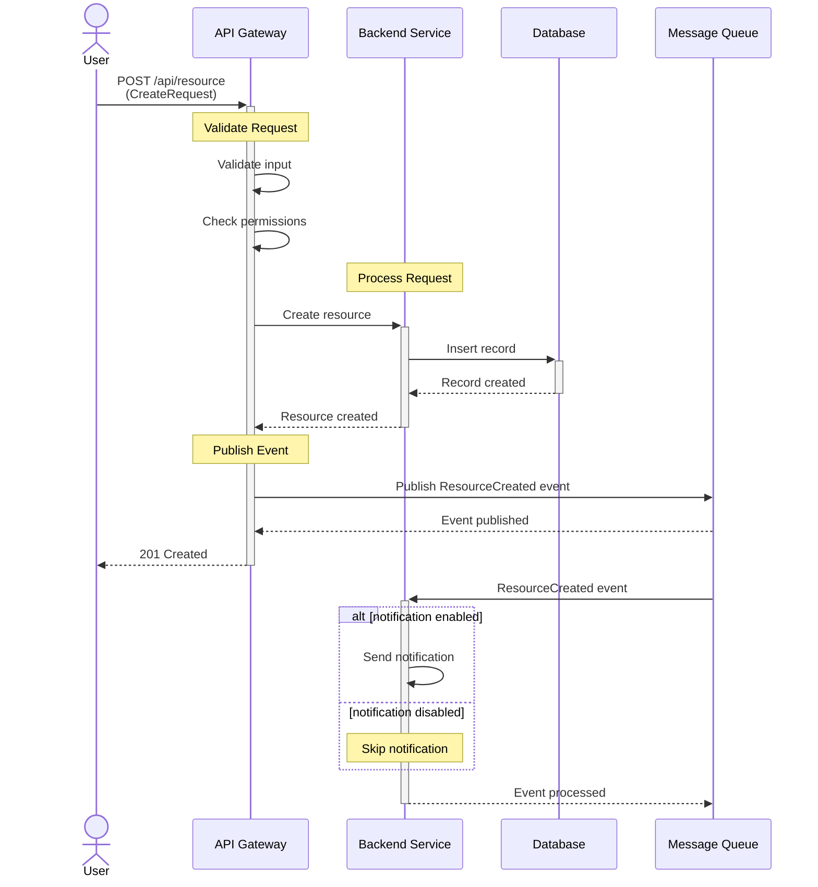

# Mermaid Sequence Diagram Patterns

## Basic Structure



## Actors and Participants

```
actor CCC as Customer Support (CCC)     # Human actor
participant OMS as Order Management     # System/service
```

## Arrow Types

```
A->>B: Solid line, solid arrow (sync request)
A-->>B: Dashed line, solid arrow (sync response)
A->>+B: Activate B's lifeline
B-->>-A: Deactivate B's lifeline
```

## Notes

```mermaid
Note over A: Single participant note
Note over A,B: Note spanning participants
```

Use notes to group logical operations:
```mermaid
Note over OMS: Update Order
OMS->>OMS: Retrieve & validate order
OMS->>OMS: Create shipment
OMS->>OMS: Save changes
```

## Conditional Flows

```mermaid
alt condition is true
    A->>B: Do this
else condition is false
    Note over A: Skip operation
end
```

## Complete Example



## Tips

- Use `<br/>` for line breaks in messages
- Keep participant aliases short but descriptive
- Group related operations with `Note over` blocks
- Activate/deactivate lifelines (`+`/`-`) for clarity
- Self-calls (`A->>A:`) show internal processing
